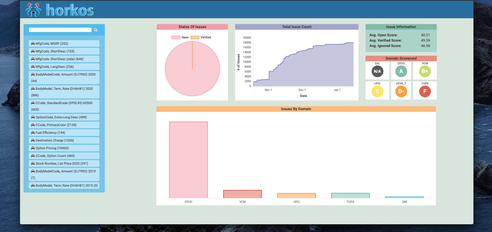

@Master

@Other

# Horkos
Horkos is a data quality analysis and scoring system designed to automate assessment of readiness for release to production environments.  Horkos uses natural language processing techniques to detect and report anomolies for correction. 

[Meet Horkos](https://en.wikipedia.org/wiki/Horkos) named for the role played in keeping data true, honest and accurate.

Composed of a [Web Interface](ui/README.md) and [ETL](extractor/README.md) the system is deployable in a many configurations, together or independently.

This project adheres to the Contributor Covent [code of conduct](CODE_OF_CONDUCT.md). By participating, you are expected to uphold this code. Please report unacceptable behaviour to [horkos.tech@gmail.com](horkos.tech@gmail.com).

# Documentation

Documentation is a bit light presently and we will continue working on this.

# Installation

Start with the [ui/readme](ui/README.md) and [extractor/readme](extractor/README.MD) and we will provide OS specific installations later.

# FAQ

# License

[Apache License 2.0](LICENSE)

